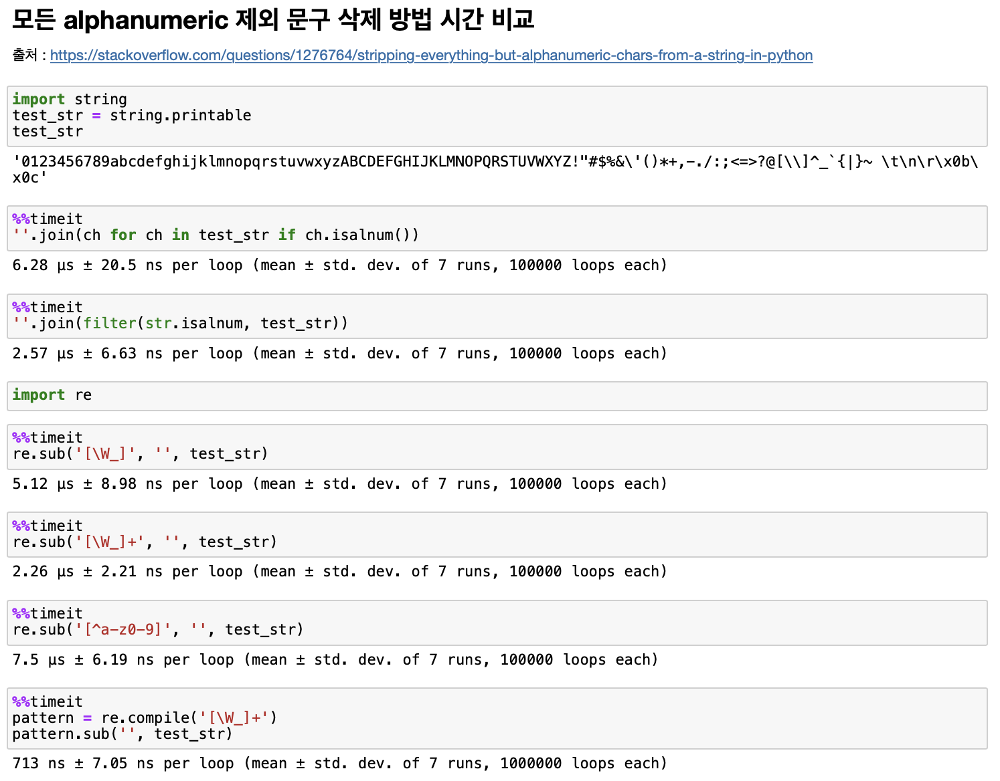

+++
title = "[ LeetCode #125 ]"
date = "2022-03-17"
categories = ["Algorithms","LeetCode"]
tags = ["Algorithms" , "Python" ,"LeetCode"]
+++

# [ LeetCode #125 ] Valid Palindrom 유효한 팰린드롬

## [ [ LeetCode #125 ] Valid Palindrome 바로가기 ](https://leetcode.com/problems/valid-palindrome/)

## 💡 유용한 지식


**‘팰린드롬’** 이란?

- 앞뒤가 똑같은 단어나 문장으로, 뒤집어도 같은말이 되는 단어 또는 문장

**리스트 pop(0) 과 데크 popleft()**

- 리스트 pop(0) 이 O(n) 인데 반해 deque popleft() 가 O(1) 이기 때문에 n번씩 반복하면 리스트는 O(n<sup>2</sup>), deque 구현은 O(n)으로 성능 차이가 크다.

**문자열 슬라이싱**

- 슬라이싱은 내부적으로 C로 구현되어 있어서 더 빠르다.
- 위치를 지정하면 해당 위치의 배열 포인터를 얻게 되며 이를 통해 연결된 객체를 찾아 실제 값을 찾아내어 슬라이싱 사용시 속도 개선에 유리하다.

**문자열 판별 함수**

```python
string.isalnum() ## alphanumeric 판별
string.isalpha() ## alphabet 판별
# 파이썬의 숫자 판별함수; 포함 범위 : numeric > digit > decimal
string.isnumeric() ## numeric 판별
string.isdigit()
string.isdecimal()
```



1. isdigit()
   - 특수 기호 중에서 어깨위에 제곱이나 세제곱을 표시하는 문자가 있다.
   - digit은 이렇게 ‘숫자처럼 생긴’ 모든 글자를 다 숫자로 치는 것이다.
2. isnumeric()
   - numeric 하다는 것은 보다 넓은 의미인데, isdigit()은 단일 글자가 ‘숫자’ 모양으로 생겼으면 True를 리턴한다고 했다.
   - isnumeric()은 숫자값 표현에 해당하는 텍스트까지 인정해준다.
   - 예를 들어 “½” 이런 특수문자도 isnumeric()에서는 True로 판정된다.
3. isdecimal()
   - 이것이 우리가 흔히 생각하는 ‘숫자’와 같은 개념이다.
   - 즉 '0123456789'의 구성으로 이루어진 10개의 글자.
   - 말 그대로 int 타입으로 즉시 변환이 가능한 리터럴을 구성하는 문자









## 문제

A phrase is a **palindrome** if, after converting all uppercase letters into lowercase letters and removing all non-alphanumeric characters, it reads the same forward and backward. Alphanumeric characters include letters and numbers.

Given a string s, return true *if it is a **palindrome**, or* false *otherwise*.


**Example 1:**

```
Input: s = "A man, a plan, a canal: Panama"
Output: true
Explanation: "amanaplanacanalpanama" is a palindrome.

```

**Example 2:**

```
Input: s = "race a car"
Output: false
Explanation: "raceacar" is not a palindrome.

```

**Example 3:**

```
Input: s = " "
Output: true
Explanation: s is an empty string "" after removing non-alphanumeric characters.
Since an empty string reads the same forward and backward, it is a palindrome.

```



**Constraints:**

- `1 <= s.length <= 2 * 105`
- `s` consists only of printable ASCII characters.

## 내가 했던 접근



- 리스트 컴프리헨션 안에 else ‘’ 가 아닌 None 으로 해서 그냥 틀린 답안을 제출함



**[ 풀이 ]**

alphanumeric 판별을 input을 차례로 읽으면서 직접 비교하였고 팰린드롬은 list의 슬라이싱으로 판별

**[ 결과 ]**

**Runtime**: 56 ms, faster than 59.39% of Python online submissions.  
**Memory Usage**: 16 MB, less than 14.33% of Python online submissions.

**[ 코드 ]**

```python
class Solution(object):
    def isPalindrome(self, s):
        alphabet= 'abcdefghijklmnopqrstuvwxyzABCDEFGHIJKLMNOPQRSTUVWXYZ'
        numeric= '0123456789'
        new_s = ''.join([char.lower() if char in alphabet \
												else (char if char in numeric else '')\
												for char in s ])
        if new_s[::-1] == new_s:
            return True
        else:
            return False
```

**[ 반성 ]**

- 과도한 리스트 컴프리헨션으로 가독성이 다소 떨어지는 것 같다.
- 사실 처음에 문제를 자세하게 정독하지 않고 ‘alphanumeric’이 아닌 알파벳으로만 생각해서 풀었다.
- 시간과 공간 효율이 좋지 못한 알고리즘인 것 같다.
- return이 True, False라면 if문 없이 더 간결하게 표현 가능하다.

## 책 풀이

**[ 풀이 ]**

- input string 을 읽어들이면서 alphanumeric을 판별하는 방식 3가지
  (1) list 와 isalnum() (2) deque 와 isalnum() (3) re 정규표현식 활용
- 팰린드롬 판별 3가지
  (1) list 의 pop() (2) deque 의 popleft() (3) list의 슬라이싱
- 위의 방법을 조합하여 총 3가지 방법 소개
  - 방법 1 : 방법 1 : list + isalnum() + pop()
  - 방법 2 : deque + isalnum() + popleft()
  - 방법 3 : re + list 슬라이싱

**[ 결과 ]**

방법 1 : list + isalnum() + pop()

**Runtime:** 276 ms, faster than 29.50% of Python online submissions for Valid Palindrome.  
**Memory Usage:** 15.2 MB, less than 37.33% of Python online submissions for Valid Palindrome.

방법 2 : deque + isalnum() + popleft()

**Runtime:** 40 ms, faster than 85.54% of Python online submissions for Valid Palindrome.  
**Memory Usage:** 14.8 MB, less than 53.26% of Python online submissions for Valid Palindrome.

방법 3 : re + list 슬라이싱

**Runtime:** 38 ms, faster than 87.41% of Python online submissions for Valid Palindrome.  
**Memory Usage:** 15.9 MB, less than 15.82% of Python online submissions for Valid Palindrome.

**[ 코드 ]**

방법 1 : list + isalnum() + pop()

```python
class Solution(object):
    def isPalindrome(self, s:str)-> bool:
        str_list = []
        for char in s:
            if char.isalnum():
                str_list.append(char.lower())
        while len(str_list)>1:
            if str_list.pop(0) != str_list.pop():
                return False
        return True
```

방법 2 : deque + isalnum() + popleft()

```python
class Solution(object):
    def isPalindrome(self, s:str)-> bool:
        str_list = []
        for char in s:
            if char.isalnum():
                str_list.append(char.lower())
        while len(str_list)>1:
            if str_list.pop(0) != str_list.pop():
                return False
        return True
```

방법 3 : re + list 슬라이싱

```python
import re
class Solution(object):
    def isPalindrome(self, s):
        s = s.lower()
        new_s = re.sub('[^a-z0-9]','',s)
        return new_s[::-1] == new_s
```
