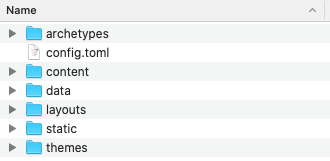
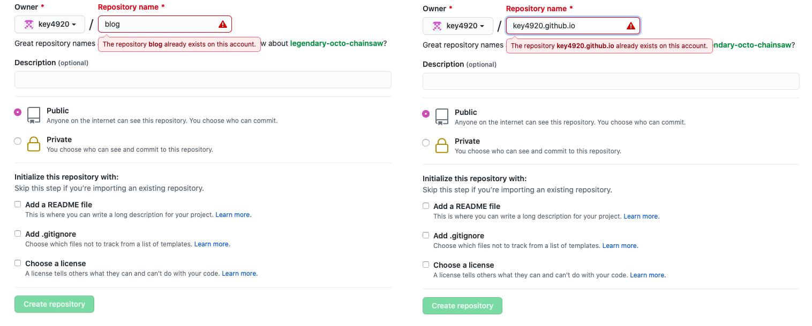
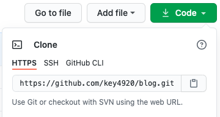
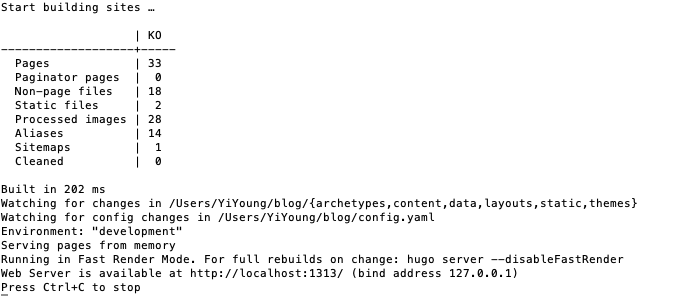

+++
title = "초보자 Hugo 블로그 구축기"
description = "무지랭이의 Hugo로 블로그 사이트 만들기 과정"
date = "2021-03-06"
categories = ["Hugo Blog"]
tags = ["Hugo" , "Mac OS" ]
+++


<!--more-->

# 초보자 Hugo 블로그 구축기

구축 환경

> **OS** : MacOS Catalina 10.15.7

# Hugo란?

: Go 언어로 쓰여진 **'정적 웹사이트 생성기'(Static site generator)** 라고 한다.   

**Go 언어란? :** 구글에서 발표한 언어로, 파이썬 같은 스크립트 언어가 아닌 **컴파일 언어**이다.  

**정적 웹사이트란? (Static site) :**

- 말 그대로 웹사이트가 '정적'(Static)인 사이트이다. 우리가 봐오는 일반적인 블로그처럼 사용자가 접속할 때마다 고정된 화면을 보여준다.
- 정적이지 않은(Dynamic) 웹사이트의 대표적인 예로는 유튜브, 네이버 등 이 있다. 이런 사이트들은 내가 접속을 할 때마다 사이트의 화면이 바뀔 수 있다.
- 정적인 웹사이트의 구축은 그렇지 않은 사이트보다 더 구축하기 쉽고 빠르다는 장점이 있다.

<span class="nowrap"><span class="emojify">→</span> </span>
 따라서 **Hugo**는 이런 **정적 사이트를 만들어 줄 수 있는 생성기**라고만 이해하고 넘어갔다.  

**그렇다면 왜 Hugo 를 선택했는가?**

- 사실 큰 이유는 없다 ㅎㅎ
- 그냥 일반적으로 많이 쓰이는 것으로 보이는 Jekyll보다 사이트 생성이 빠르다고 하였고 Go언어를 공부해보고자 하는 사람들이 많이 시도해 본 것으로 보인다.
- 어차피 제로 베이스로 시작하는거, 나에겐 Jekyll이나  Hugo나 외계어로 보이는건 똑같았다.

자 이제 생성을 시작해보자!

## STEP1. Hugo 설치

나는 맥북이므로 brew를 활용하여 설치하였다.

brew 가 없다면 [brew](https://brew.sh/index_ko) 에서 설치 해 준다. 

```bash
$ brew install hugo 

## 설치 후 버전 확인으로 설치가 잘 됏는지 확인해보자
$ hugo version
```

윈도우이거나 brew 이외의 설치 방법은 Hugo 공식 사이트인  [https://gohugo.io/getting-started/quick-start/](https://gohugo.io/getting-started/quick-start/) 나 하단 Reference의 블로그들을 참고해 주시길 바란다.

## STEP2. Hugo 블로그 폴더 생성

사실 용어는 잘 모르겠다.ㅎㅎ   
그냥 쉽게 생각하면 앞으로 블로그에 올라갈 콘텐츠들이나 테마 등 모든 것이 담기는 폴더라고 생각하면 된다.   

```bash
## 폴더 이름은 마음대로 지정해도 된다. 
## 나는 blog라고 지었는데 변경을 원하면 blog 대신 다른 이름을 쓰면 된다.
$ hugo new site blog
```

나는 그냥 /Users/내이름/  경로에서 명령어를 입력하여 생성했다.  

생성 되면 Hugo site가 생성됐다며 아래와 같은 메세지가 출력된다!  

```bash
Congratulations! Your new Hugo site is created in /Users/내이름/blog.
Just a few more steps and you're ready to go:
**
1. Download a theme into the same-named folder.
   Choose a theme from https://themes.gohugo.io/ or
   create your own with the "hugo new theme <THEMENAME>" command.
2. Perhaps you want to add some content. You can add single files
   with "hugo new <SECTIONNAME>/<FILENAME>.<FORMAT>".
3. Start the built-in live server via "hugo server".

Visit https://gohugo.io/ for quickstart guide and full documentation.
```

/Users/내이름/blog 폴더에 들어가면 아래와 같은 기본적인 구조가 생성 돼 있다.




## STEP3. 테마 추가하기

나는 다른 분들이 이쁘게 만들어주신 테마를 사용할 것이다.ㅎㅎ  
**hugo theme 사이트 :** [themes.gohugo.io](https://themes.gohugo.io)  
**내가 선택한 테마 :**  [https://themes.gohugo.io/hugo-book/](https://themes.gohugo.io/hugo-book/)    

- Hugo 버전이 **최신 버전** 이어야하면 upgrade 해준다.

```bash
## 버전 확인 ; 0.78.0 이상이 아니라면 upgrade 필요하다.
$ hugo version

## (참고) 나는 brew로 간단하게 upgrade 해줬다.
$ brew upgrade hugo 
```

이제 내가 고른 테마를 다운 받자!  
--> 저 테마의 github : [hhttps://github.com/alex-shpak/hugo-book.git](https://github.com/alex-shpak/hugo-book.git)   

```bash
## 우선, STEP2에서 만든 blog 경로로 들어가자
$ cd blog

## 테마 다운로드
$ git init
$ git submodule add https://github.com/alex-shpak/hugo-book.git themes/book
```

이제 아까 blog 폴더 내에 themes에 들어가보면 'book' 폴더가 생긴 것을 볼 수 있다.  
그 다음, 보통 글을 한개를 써서 올려보라는데 사실 나는 어떻게 해야하는지 감이 없어서 애를 먹었더랬다.   
뒤에 할 터이니 우선 다음 step으로 넘어가자!    

## STEP4. Github 저장소 생성

[https://gohugo.io/hosting-and-deployment/hosting-on-github/](https://gohugo.io/hosting-and-deployment/hosting-on-github/)  

Github 저장소 2개를 생성 해야 한다.  
1. 하나는 블로그 컨텐츠 저장소 생성 (blog)  
2. 다른 하나는 렌더링된 웹사이트를 담을 저장소 (key4920.github.io)  

사실 뭔소린지 잘 모른다. 내가 아는 것은 **2개를 생성**해야하고, 2번인 웹사이트를 담을 저장소는 이름을 <USERNAME>github.io 로 지어야 한다는 것이다.  

**< 나의 첫번째 뻘짓 >**  
2번 저장소의 USERNAME 부분이 내 id 이어야 한다는 것을 무시하고, 내 마음대로 지어보려 했다가 자꾸 에러가 났었다.  
반드시 본인의 **github id**로 생성해 주어야한다. 바꿀 수 있는 것 같지만, 나중에 시간이 남으면 시도해 보도록하고, 패스한다.   




두개 모두 이미 가지고 있으므로 already exists라고 뜨지만 그냥 저렇게 생성해주면 된다.  
1번 저장소인 'blog'를 내가 처음에 만들었던 'blog' 폴더랑 연동 해 주고   
2번 저장소인 'key4920.github.io'를 submodule로 등록 해 준다.

```bash
## 우선 처음 만들었던 blog 폴더로 이동 (이미 들어와 있으면 패스)
cd blog

## git 연동
$ git init
$ git remote add origin https://github.com/key4920/blog.git
$ git submodule add -b main git@github.com:key4920/key4920.github.io.git public
```

**<나의 두번째 뻘짓 >** 
1. blog remote할 때 Permission denied (publickey).에러가 났다. 
- 잘 모르지만 github 주소를 'https' 'ssh' 중에 **'https' 주소**로 하니 됐고
2. [key4920.github.io](http://key4920.github.io) submodule 할 때는 Unable to checkout submodule ‘public’ 에러가 났다.
- 얘는 **'ssh' 주소**로 하니 됐다... 왜인지는 모르겠다...



## STEP5. 예시 사이트 보기

아까 언급했듯이, 막상 글을 쓰려니 어떻게 해야하는지 막막했다.   
그런데 보통 themes/book 폴더 내에 들어가보면 'exampleSite' 폴더가 있다.   
'exampleSite' 폴더 안에 있는 모든 폴더 및 파일들을 복사해서 blog 폴더 안에 덮어쓰기 해준다.  
- 이때 내가 고른 테마의 exampleSite 안에는 'config.yaml' 파일이 있는데  
이건 기본적으로 생성 돼 있던 'config.toml' 파일과 동일한 것이지만 파일 확장자가 달라서 '덮어쓰기'가 안됐으므로 'config.toml' 파일은 삭제 해 줬다.

```bash
$ hugo server -D
```

입력해주면 아래와 같은 문구와 함께 [http://localhost:1313/](http://localhost:1313/) 에 접속하라고 뜨는데, 이 url은 내 사이트를 build하기 전 예시로 보여주는 기능이다.   
웹에 이 url을 복붙해서 들어가면 현재 내 blog의 예시 사이트를 볼 수 있다.



나 같은 초보자들은 이제 exampleSite에서 복붙했던 content 내의 예시 글들을 참고해서 blog 내의 구조를 익히면 된다.  
내가 고른 테마 같은 경우엔, 블로그에 올라가는 일반적인 글 경로는 blog/content/post/콘텐츠이름 에 있었다.

**< 나의 세번째 뻘짓 >**  
이건 내가 써봤던 'stack' 테마에 한정된 이야기 이지만, 'config.yaml' 안에  dateFormat 이 있었는데 모두 #를 앞에 붙여서 주석처리 해 주었다. 이게 있으니 자꾸 콘텐츠의 글의 날짜가 이상한 형식으로 보였다.  
더이상 지원하지 않는다고하니 주석처리 해주거나 지워준다.  

여태까지는 blog 폴더 안에 어느 형식으로 어떤 구조로 콘텐츠를 넣으면 어떻게 보이는지를 살펴보았다.
하지만, 실제 내 블로그 url인 [key4920.github.io](http://key4920.github.io) 를 입력해서 들어가도 사이트가 build 된 상태가 아니다.   
앞의 [http://localhost:1313/](http://localhost:1313/) 에서 결과가 맘에 들면 git 업로드 해줘야 실제 내 블로그에 적용된다.  

## STEP6. 사이트에 글 업로드

blog 폴더에 들어가서 'deploy.sh' 파일을 하나 생성하고 파일 안에 아래 내용을 복붙해서 저장해준다.  

- 이때 hugo -t book 부분에서 'book'을 본인 테마 이름으로 수정 해 준다.

```bash
#!/bin/sh
# If a command fails then the deploy stops
set -e
printf "\033[0;32mDeploying updates to GitHub...\033[0m\n"
# Build the project.
####### 이부분을 본인 테마로 변경해주세요~ #######
hugo -t book 
# Go To Public folder
cd public
# Add changes to git.
git add .
# Commit changes.
msg="rebuilding site $(date)"
if [ -n "$*" ]; then
	msg="$*"
fi
git commit -m "$msg"
# Push source and build repos.
git push origin main
cd ..
# anyblogname 업데이트
git add .
msg="rebuilding site `date`"
if [ $# -eq 1 ]
  then msg="$1"
fi
git commit -m "$msg"
git push origin main
```

원래는 이 파일 안에 한줄 한줄을 터미널에서 매번 실행 해 주어야하지만, 귀찮으므로 이런 파일을 만들고 파일만 실행하면 안의 코드가 실행되게 하는 원리이다.  

이제 이 파일을 실행해보자!  

```bash
## 뒤에는 그냥 커밋 메시지이다. 
$ ./deploy.sh "message"
```

**< 나의 네번째 뻘짓 >**   
이때 나는 권한이 없다며 에러가 났다. 아래 코드로 권한 지정해주자  
또한 가끔 내가 변경한 파일이 untracked file이어서 Github로 push가 안 된다.    
이럴 때는 위의 [deploy.sh](http://deploy.sh) 파일 내의 코드들을 한줄씩 직접 실행 해 준다.    

```bash
## 권한 에러 있었다면 지정
chmod +x deploy.sh
```
그래도 혹시 권한 에러가 난다면, System Preferences > Security & Privacy > Privacy > Full Disk Access 에 Terminal 을 추가해준다.
나같은 경우는 그래도 권한 에러가 났다. 그래서 아래 코드로 해결했다.

```bash
$ xattr -l deploy.sh ## 프린트 된 것 com.apple.quarantine 이 있다면 아래 명령어로 삭제
$ xattr -d com.apple.quarantine deploy.sh ## 삭제
## 다시 권한 부여 후 파일 실행
$ chmod +x deploy.sh
$ ./deploy.sh "message"
```

---

### 앞으로 블로그 업데이트에 필요한 일

1. content 폴더 내에 마크다운 형식으로 글 파일 넣거나 (자세한 경로는 본인 테마마다 상이할 수 있습니다.) config 등 다른 파일 customising
2. 콘텐츠 업로드에 필요한 코드

```bash
## 본인 hugo blog 폴더 들어가기
$ cd blog 
## (옵션) 예시 사이트를 보는 것이므로 옵션 
$ hugo server -D 
## 빠져나오려면 Ctrl + C
$ ./deploy.sh "commit message"
```

---

### 추가 기능

1. config 파일에서 원하는대로 이것저것 변경 해준다.  
    - DefaultContentLanguage: ko 로 언어도 수정해주고
    - favicon이나 이미지도 넣어주는 등 다양하게 커스터마이징 해 주었다!
2. 구글이나 네이버, 다음에 글이 검색 될 수 있도록 노출 시키는 기능 추가 또는 구글 애드센스 넣기    
3. 댓글 기능 넣기

등 다양하게 기능을 넣어 본인의 블로그를 구축해 나갈 수 있다~  

앞으로 다른 글에서 다뤄보도록 하겠다.  

---

## Reference

[https://gohugo.io/getting-started/quick-start/](https://gohugo.io/getting-started/quick-start/)  
[https://gohugo.io/hosting-and-deployment/hosting-on-github/](https://gohugo.io/hosting-and-deployment/hosting-on-github/)  
[https://github.com/Integerous/Integerous.github.io](https://github.com/Integerous/Integerous.github.io)  
[https://hoontaeklee.github.io/20191229_blogging_with_hugo/#2-unable-to-checkout-submodule-public](https://hoontaeklee.github.io/20191229_blogging_with_hugo/#2-unable-to-checkout-submodule-public)  