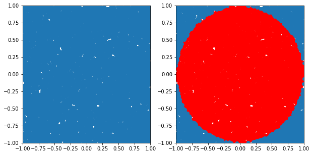

<!--more-->

설치 환경

> **OS** : MacOS Catalina 10.15.7  
**Java** : java 11.0.1  
**Python** : Python 3.7.6  
**Spark** : spark 3.0.1


## STEP1. 스파크 버전 선택 후 다운로드

NT. Java 와 Python은 설치 돼 있다는 가정으로 진행한다.  
__스파크 다운로드 사이트 링크__ : [Downloads | Apache Spark](http://spark.apache.org/downloads.html)  
사이트에 접속하면 아래 화면이 나오게 된다.  


원래는 Spark 2.4.7 을 선택해서 설치했었다.  
하지만 로컬의 Java 버전이 11이었으므로, 그냥 이참에 Spark3.0을 시도해보기로 했다!

(참고) Spark3.0은 Java 11을 지원하고, Spark2.X는 Java 8을 지원한다.

우선 원하는 Spark 버전 선택하여 'Download Spark' 를 클릭해주면 다음과 같은 화면으로 넘어간다.


mirror sites 중 한개를 선택해 다운로드 해주는데, 그냥 최상단 링크를 눌러 다운로드 해준다.


## STEP2. 다운로드한 압축 파일을 home directory에 풀어준다.

```bash
tar -zxvf spark-3.0.1-bin-hadoop3.2.tar
```

## STEP3. ~/.bash_profile 환경변수 수정

어떤 directory에서도 spark notebook 열 수 있도록 환경변수 설정해준다.

```bash
## .bash_profile 있는지 확인
ls -a 
## .bash_profile 파일 열기
nano .bash_profile
## 또는 
vi .bash_profile
```

 

아래 환경변수 추가로 써준다.

```bash
## 버전 맞게 써주기
export SPARK_PATH=~/spark-3.0.1-bin-hadoop3.2 
## PySpark Shell을 주피터 노트북에서 열 수 있도록 설정
export PYSPARK_DRIVER_PYTHON="jupyter"
export PYSPARK_DRIVER_PYTHON_OPTS="notebook"

## 파이썬 3를 사용한다면 아래 설정 추가해 주어야 에러가 나지 않음
export PYSPARK_PYTHON=python3

## sparknb는 명령어 마음대로 써준 것이므로, 원하는 이름으로 수정 가능
## local[2] 는 로컬 코어 2개를 사용한다는 뜻으로 본인 로컬 환경에 맞게 수정 가능
alias sparknb='$SPARK_PATH/bin/pyspark --master local[2]'
```

만약 nano .bash_profile 했었으면  ^x —> Y —> enter 로 저장하고 빠져나오기

vi .bash_profile 했었으면 :wq 입력 후 저장하고 빠져나오기

```bash
source .bash_profile
```

## STEP4. 실행 확인
### spark-shell 실행
```bash
## 터미널에서 spark-shell 입력하여 스파크 쉘 실행
spark-shell
```
터미널에 spark-shell 입력하면 아래와 같이 정상적으로 실행되면서 스칼라를 통해 코드를 작성할 수 있다.


### 주피터 노트북에서 실행

```bash
## 터미널에서 sparknb입력하여 주피터 노트북 실행
## 위에서 alias 다른 이름으로 설정했다면, 해당 이름으로 실행
sparknb
```
명령어 입력하면 주피터 노트북이 켜지고, pyspark를 작성할 수 있다.


## STEP 5. 이제 모두 완료됐으니, 간단한 실습해보자!

### 주피터 노트북에서 파이썬 코드 작성

```python
# Reason why we have the getOrCreate code
# http://stackoverflow.com/questions/28999332/how-to-access-sparkcontext-in-pyspark-script
sc = SparkContext.getOrCreate()
```


```python
import numpy as np

TOTAL = 1000000
dots = sc.parallelize([2.0 * np.random.random(2) - 1.0 for i in range(TOTAL)]).cache()
print("Number of random points:", dots.count())

stats = dots.stats()
print('Mean:', stats.mean())
print('stdev:', stats.stdev())
```

Number of random points: 1000000    
Mean: [-0.00076914  0.00090079]  
stdev: [0.57721218 0.57750566]


```python
dots.collect()[:5] ## 형식 구경하기
```


[array([0.71638614, 0.34966844]),  
 array([0.85926697, 0.43265725]),  
 array([-0.12204166, -0.8161978 ]),  
 array([-0.96733469, -0.57462963]),  
 array([-0.13704113, -0.48361848])]


```python
dots
```


ParallelCollectionRDD[0] at readRDDFromFile at PythonRDD.scala:262


```python
%matplotlib inline
from operator import itemgetter
from matplotlib import pyplot as plt

plt.figure(figsize = (10, 5))

# Plot 1
plt.subplot(1, 2, 1)
plt.xlim((-1.0, 1.0))
plt.ylim((-1.0, 1.0))

sample = dots.sample(False, 0.01)
X = sample.map(itemgetter(0)).collect()
Y = sample.map(itemgetter(1)).collect()
plt.scatter(X, Y)

# Plot 2
plt.subplot(1, 2, 2)
plt.xlim((-1.0, 1.0))
plt.ylim((-1.0, 1.0))

inCircle = lambda v: np.linalg.norm(v) <= 1.0
dotsIn = sample.filter(inCircle).cache()
dotsOut = sample.filter(lambda v: not inCircle(v)).cache()

# inside circle
Xin = dotsIn.map(itemgetter(0)).collect()
Yin = dotsIn.map(itemgetter(1)).collect()
plt.scatter(Xin, Yin, color = 'r')

# outside circle
Xout = dotsOut.map(itemgetter(0)).collect()
Yout = dotsOut.map(itemgetter(1)).collect()
plt.scatter(Xout, Yout)
```


<matplotlib.collections.PathCollection at 0x7f88920d0a50>





## Reference

[Install Spark on Mac (PySpark)](https://medium.com/@GalarnykMichael/install-spark-on-mac-pyspark-453f395f240b)

[[mac] Apache Spark Study -1 ( Spark설치(HomeBrew) )](https://kingname.tistory.com/159)

[apache-spark@3.0.1 설치](https://parkaparka.tistory.com/27)



<style>
.canon { background: white; width: 100%; height: auto; }
</style>

