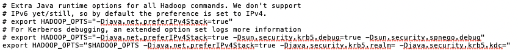
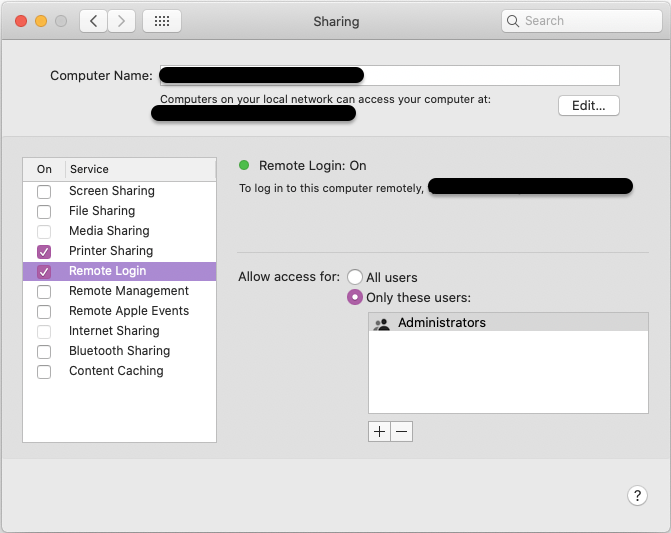
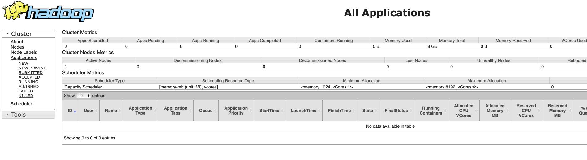

+++
title = "Mac OS에 하둡(Hadoop) 설치"
description = "맥북 Mac OS에 Hadoop을 설치해보자!"
date = "2021-02-27"
categories = ["BigData Platform", "Hadoop"]
tags = ["Hadoop" , "Mac OS" ]
# image = "hadoop_background4.jpg"
+++


<!--more-->


### 설치 환경

> **OS** : MacOS Catalina 10.15.7  
**Hadoop** : 3.3.0

## STEP1. 하둡 설치

터미널에 명령 입력

```bash
brew install hadoop
```

만약 brew가 없다면 [Homebrew](https://brew.sh/index_ko)에 접속하여 설치해준다.


## STEP2. 환경변수 수정

```bash
## 하둡 버전 X.X.X는 본인이 설치한 버전으로 수정 
cd /usr/local/cellar/hadoop/3.3.0/libexec/etc/hadoop
```

Finder에서 저 경로가 보이지 않았지만, 터미널에서 명령어 치니 경로가 잘 들어가지긴 했다.

그래도 직접 Finder에서 보기 위해서 Finder에서 **_'Cmd+Shift+G'_** 를 치니 경로 검색 창이 떴고 그걸로 들어가니 Finder에서 볼 수 있었다.

**수정해야 할 파일들**

> **(1) hadoop-env.sh**  
**(2) core-site.xml**  
**(3) hdfs-site.xml**  
**(4) mapred-site.xml**  
**(5) yarn-site.xml**  

### 2-1. hadoop-env.sh 변경

```bash
open hadoop-env.sh
```

파일을 열어서 HADOOP_OPTS 부분을 변경해 줘야한다.

열어보니 아래 주석처리된 부분만 적혀있어서 마지막 한줄을 추가해서 입력해 주었다.



```bash
export HADOOP_OPTS=”-Djava.net.preferIPv4Stack=true -Djava.security.krb5.realm= -Djava.security.krb5.kdc=”
```

또한, 터미널에 아래 명령어 입력하면 java경로를 보여준다. 

```bash
/usr/libexec/java_home
```

이때 나온 경로 또한 *'hadoop-env.sh'* 파일 안에 없다면 추가해준다.

```bash
export JAVA_HOME=“/Library/Java/JavaVirtualMachines/adoptopenjdk-8.jdk/Contents/Home”
```

### 2-2. core-site.xml 변경

```bash
open core-site.xml
```

파일을 열어 <configuration> 태그에 복사하여 넣어준다.

```html
<configuration>
      <property>
          <name>hadoop.tmp.dir</name>
          <value>/usr/local/Cellar/hadoop/hdfs/tmp</value>
          <description>A base for other temporary directories.</description>
      </property>
      <property>
          <name>fs.default.name</name>
          <value>hdfs://localhost:9000</value>
      </property>
</configuration>
```

### 2-3. hdfs-site.xml 변경

```bash
open hdfs-site.xml
```

파일을 열어 <configuration> 태그에 복사하여 넣어준다.

```html
<configuration>
    <property>
        <name>dfs.replication</name>
        <value>1</value>
    </property>
</configuration>
```

### 2-4. mapred-site.xml 변경

```bash
open mapred-site.xml
```

파일을 열어 <configuration> 태그에 복사하여 넣어준다.

```html
<configuration>
  <property>
    <name>mapreduce.framework.name</name>
    <value>yarn</value>
  </property>
  <property>
    <name>mapreduce.application.classpath</name>   
	  <value>$HADOOP_MAPRED_HOME/share/hadoop/mapreduce/*:$HADOOP_MAPRED_HOME/share/hadoop/mapreduce/lib/*</value>
  </property>
</configuration>
```

### 2-5. yarn-site.xml 변경

```bash
open yarn-site.xml
```

파일을 열어 <configuration> 태그에 복사하여 넣어준다.

```html
<configuration>
	<property>
		<name>yarn.nodemanager.aux-services</name>
		<value>mapreduce_shuffle</value>
	</property>
	<property>
		<name>yarn.nodemanager.env-whitelist</name>
		<value>JAVA_HOME,HADOOP_COMMON_HOME,HADOOP_HDFS_HOME,HADOOP_CONF_DIR,CLASSPATH_PREPEND_DISTCACHE,HADOOP_YARN_HOME,HADOOP_MAPRED_HOME</value>
	</property>
</configuration>
```

## STEP3. 하둡 실행

### 3-1. 실행 전 준비

```bash
ssh localhost
```

터미널에 위 명령어를 입력해 봤을 때 마지막 접속시간이 안뜨고 Connection refused 라고 뜨면,

아래 명령어를 입력해준다.

```bash
ssh-keygen -t rsa -P '' -f ~/.ssh/id_rsa
cat ~/.ssh/id_rsa.pub >> ~/.ssh/authorized_keys
chmod 0600 ~/.ssh/authorized_keys
```

그냥 hadoop 폴더 내에서 입력했더니 ./ssh 폴더가 없다고 떴다. 

나 같은 경우는 가장 하위 홈 디렉토리에서 명령어 입력하니 됐다. (/Users/"user_name"/)

이제 HDFS 로 포맷한다.

```bash
cd /usr/local/cellar/hadoop/3.3.0/libexec/bin
hdfs namenode -format
```

### 3-2. 하둡 실행

```bash
cd /usr/local/cellar/hadoop/3.3.0/libexec/sbin
./start-all.sh
# 또는
./start-dfs.sh
# 또는
./start-yarn.sh
```

위 명령어를 입력해주면 정상적으로 실행된다.

만약 아래 같은 에러가 나면 원격 로그인을 허용하지 않은 것이므로 환경설정에서 허용 해준다.

```bash
"localhost: ssh: connect to host localhost port 22: Connection refused"
```

환경설정 > 공유 > 원격 로그인에 체크박스를 눌러준다.



### 3-3. 실행 확인

```bash
jps
```

jps 를 터미널에 입력해주면, 하둡이 정상 설치 및 실행되고 있음을 아래와 같이 보여준다. 

```bash
29171 NodeManager
28644 NameNode
29255 Jps
28745 DataNode
28206 ResourceManager
28879 SecondaryNameNode
```

그럼 이제 *localhost* 로 접속해서 확인해보자

> **Cluster status** : [http://localhost:8088](http://localhost:8088/)   
**HDFS status** : [http://localhost:9870](http://localhost:9870/)    
**Secondary NameNode status** : [http://localhost:9868](http://localhost:9868/)    

### Cluster status



### HDFS status


### 3-4. 실행 종료

```bash
## 만약 경로가 아래 경로에 들어와 있지 않다면 다시 들어가준다. 
## 하지만 해당 경로에서 ./start-all.sh 로 실행 해 줬기 때문에 
## 그냥 아래 ./stop-all.sh만 실행해주면 된다.
# cd /usr/local/cellar/hadoop/3.3.0/libexec/sbin

./stop-all.sh
# 또는
./stop-dfs.sh
# 또는
./stop-yarn.sh

```

## Reference

[Installing Hadoop on a Mac](https://towardsdatascience.com/installing-hadoop-on-a-mac-ec01c67b003c)

[macOS에서 Hadoop 설치하기](https://rap0d.github.io/tip/2019/10/01/mac_hadoop_in_mac/)