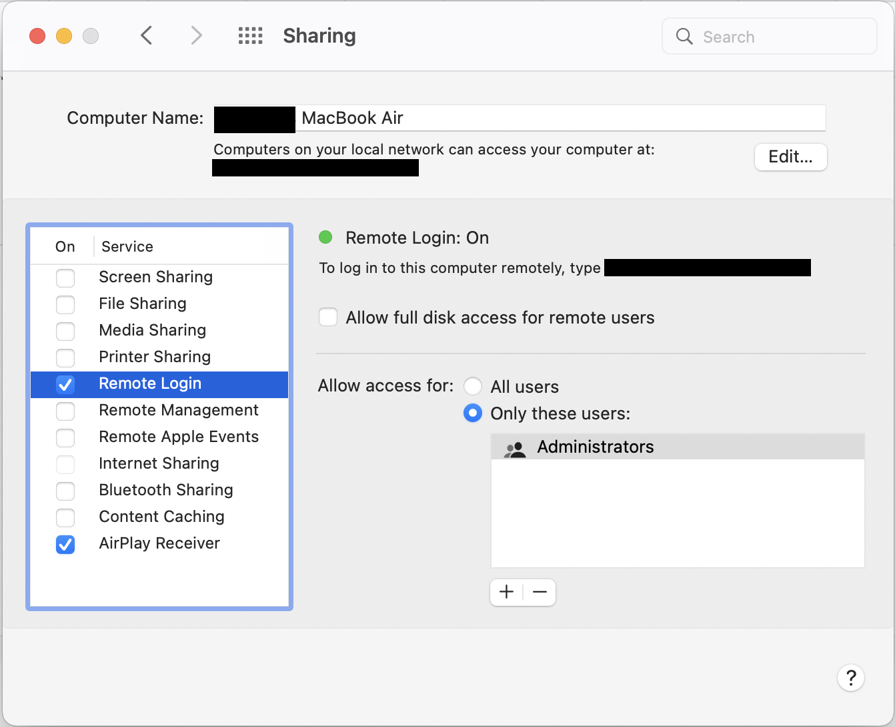
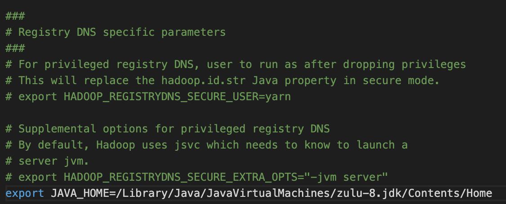
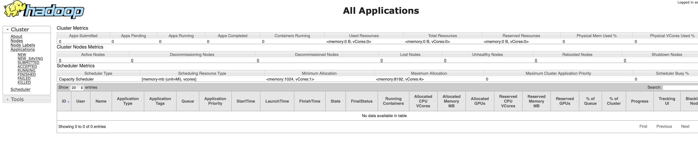
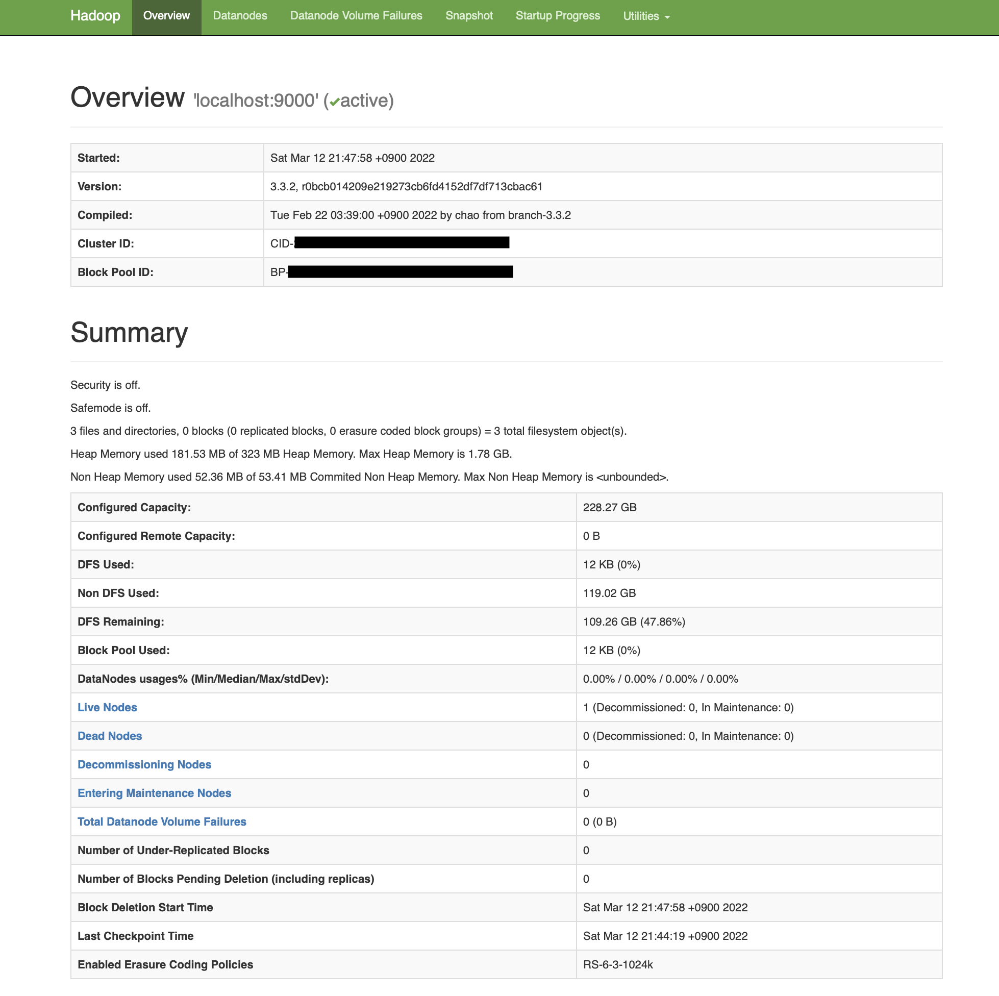
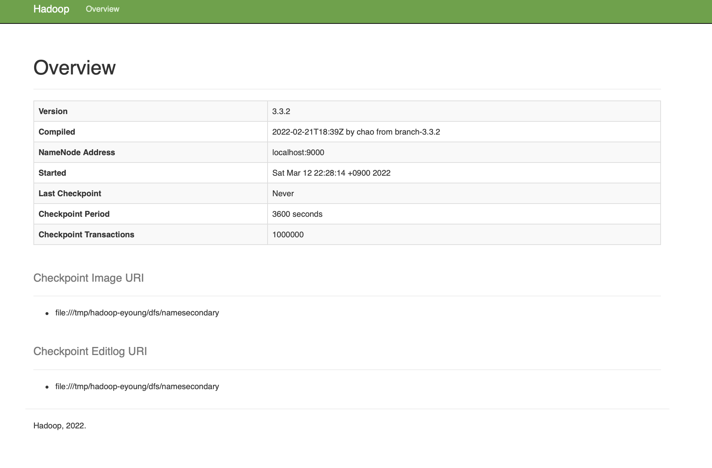

+++
title = "[M1] Mac OS에 하둡(Hadoop) 설치"
description = "맥북 Mac OS에 Hadoop을 설치해보자!"
date = "2022-03-11"
categories = ["BigData Platform", "Hadoop"]
tags = ["Hadoop" , "Mac OS"]
+++

<!--more-->

# [M1] Mac OS에 하둡(Hadoop) 설치

## 설치 개요


**[ 설치 목적 ]** 하둡의 맵리듀스와 분산 파일 시스템인 HDFS를 경험해보자!  
**[ 설치 환경 ]**  
&ensp; **OS** : [M1] MacOS Monterey 12.0.1  
&ensp; **Hadoop** : 3.3.2

**[ 기초 배경지식 ]**  
&ensp; 하둡 맵리듀스는 수천개의 노드로 구성된 클러스터에서 병렬로 데이터를 처리하는 오픈소스 프레임워크이다. 하지만 개인이 클러스터 환경을 갖추기 어려우니, 하둡에서 Single node 설치 방법을 제공해준다.

**[ 설치 링크 ]**  
&ensp; (1) [Cluster Setup](https://hadoop.apache.org/docs/stable/hadoop-project-dist/hadoop-common/ClusterSetup.html)  
&ensp; (2) [Single Node Setup](https://hadoop.apache.org/docs/stable/hadoop-project-dist/hadoop-common/SingleCluster.html#Execution)

나는 **Single Node Setup**을 따르며  
(1) Local (Standalone) Mode (2) Pseudo-Distributed Mode (3) Fully-Distributed Mode  
 3가지 모드 중 **Pseudo-Distributed Mode** 로 설치하며 Yarn 사용을 위한 세팅도 진행한다.

**[ 사전 체크 항목 ]**  
&ensp; Supported platforms : 기본적으로 Linux/GNU/Window 지원  
&ensp; Required software :  
&ensp; &ensp; (1) [지원 Java 버전 설치](https://cwiki.apache.org/confluence/display/HADOOP/Hadoop+Java+Versions) : Java 8 과 11 지원하지만, compile시 Java 11은 지원하지 않는다.  
&ensp; &ensp; (2) ssh 설치




```bash
ssh localhost ## 터미널에서 ssh 설치 여부 확인
```


**[ Troubleshooting #1 ]** : Connection refused  
아래와 같은 에러가 나면 원격 로그인을 허용하지 않은 것이므로 환경설정에서 허용 해준다.

```bash
"ssh: connect to host localhost port 22: Connection refused"
```

환경설정 > 공유(Sharing) > 원격 로그인(Remote Login)에 체크박스를 눌러준다.




**[ Troubleshooting #2 ]** : Password  
Password를 입력하라고 뜬다면 나중에 하둡 실행시 Permission denied 오류가 나므로 미리 권한을 부여해주자

```bash
ssh-keygen -t rsa -P '' -f ~/.ssh/id_rsa
cat ~/.ssh/id_rsa.pub >> ~/.ssh/authorized_keys
chmod 0600 ~/.ssh/authorized_keys
```




## STEP1. 하둡 설치

터미널에 명령 입력

```bash
brew install hadoop
```

만약 brew가 없다면 [Homebrew](https://brew.sh/index_ko)에 접속하여 설치해준다.  
만약 brew가 아닌 직접 설치를 원한다면 [Hadoop](https://www.apache.org/dyn/closer.cgi/hadoop/common/)에서 원하는 버전의 파일을 다운받고 압축을 해제해주면 설치가 완료된다.

## STEP2. 환경변수 수정

```bash
## 하둡의 버전과 설치된 경로를 확인
brew info hadoop
## 경로는 위 명령어로 확인 및 하둡 버전 X.X.X는 본인이 설치한 버전으로 수정
cd /opt/homebrew/Cellar/hadoop/3.3.2
```

Finder에서 저 경로가 보이지 않았지만, 터미널에서 명령어 치니 경로가 잘 들어가지긴 했다.

그래도 직접 Finder에서 보기 위해서 Finder에서 **_'Cmd+Shift+G'_** 를 치니 경로 검색 창이 떴고 그걸로 들어가니 Finder에서 볼 수 있었다.
앞으로 수정해야할 하위 파일들은 아래 경로에 있으니 들어가준다.

```bash
cd libexec/etc/hadoop
```


**앞으로 수정해야 할 파일들**

**(1) hadoop-env.sh** (하둡 사용)  
**(2) core-site.xml** (Pseudo-Distributed Mode)  
**(3) hdfs-site.xml** (Pseudo-Distributed Mode)  
**(4) mapred-site.xml** (YARN)  
**(5) yarn-site.xml** (YARN)



### 2-1. hadoop-env.sh 변경

```bash
open hadoop-env.sh
```

파일을 열고 아래 명령어로 본인의 자바 경로를 확인 후 나온 경로를 추가해준다.

```bash
## 자바 경로 확인
/usr/libexec/java_home
## 버전이 여러개라면 버전 특정하기
/usr/libexec/java_home -v8
```

```bash
export JAVA_HOME="/Library/Java/JavaVirtualMachines/zulu-8.jdk/Contents/Home"
```

아래 그림처럼 그냥 맨 마지막줄에 추가해주면 된다.


이제, 하둡 클러스터를 사용할 준비가 완료됐다.  
하둡 최상위 경로에서 아래 명령어를 치면 정상 실행되는지 확인 가능하다!

```bash
bin/hadoop
```

Single Node 지만 다음 3가지 모드가 지원되며 내가 사용하고 싶은 Pseudo-Distributed Mode를 위해 추가적으로 환경변수를 수정하자  
(1) Local (Standalone) Mode (2) Pseudo-Distributed Mode (3) Fully-Distributed Mode

**Pseudo-Distributed Mode란?** : 각 하둡 daemon이 각각의 분리된 Java 프로세스에서 실행되는 모드로, standalone 모드와 다르게 가상으로 분산시스템을 경험할 수 있다.

### 2-2. core-site.xml 변경

```bash
open core-site.xml
```

파일을 열어 <configuration> 태그에 복사하여 넣어준다.

```html
<configuration>
  <property>
    <name>fs.defaultFS</name>
    <value>hdfs://localhost:9000</value>
  </property>
</configuration>
```

### 2-3. hdfs-site.xml 변경

```bash
open hdfs-site.xml
```

파일을 열어 <configuration> 태그에 복사하여 넣어준다.

```html
<configuration>
  <property>
    <name>dfs.replication</name>
    <value>1</value>
  </property>
</configuration>
```

이제 로컬에서 맵리듀스를 실행해 볼 수 있지만,  
YARN으로 맵리듀스 및 리소스매니저와 노드매니저 daemon 을 실행해보기 위해서 추가적으로 더 환경변수를 수정해준다.

### 2-4. mapred-site.xml 변경

```bash
open mapred-site.xml
```

파일을 열어 <configuration> 태그에 복사하여 넣어준다.

```html
<configuration>
  <property>
    <name>mapreduce.framework.name</name>
    <value>yarn</value>
  </property>
  <property>
    <name>mapreduce.application.classpath</name>
    <value
      >$HADOOP_MAPRED_HOME/share/hadoop/mapreduce/*:$HADOOP_MAPRED_HOME/share/hadoop/mapreduce/lib/*</value
    >
  </property>
</configuration>
```

### 2-5. yarn-site.xml 변경

```bash
open yarn-site.xml
```

파일을 열어 <configuration> 태그에 복사하여 넣어준다.

```html
<configuration>
  <property>
    <name>yarn.nodemanager.aux-services</name>
    <value>mapreduce_shuffle</value>
  </property>
  <property>
    <name>yarn.nodemanager.env-whitelist</name>
    <value
      >JAVA_HOME,HADOOP_COMMON_HOME,HADOOP_HDFS_HOME,HADOOP_CONF_DIR,CLASSPATH_PREPEND_DISTCACHE,HADOOP_YARN_HOME,HADOOP_HOME,PATH,LANG,TZ,HADOOP_MAPRED_HOME</value
    >
  </property>
</configuration>
```

## STEP3. 하둡 실행

### 3-1. 실행 전 준비

```bash
ssh localhost
```

ssh 를 한번 더 체크해보고 만약 마지막 접속 시간이 뜨지 않으면 페이지 상단에 "ssh 설치 여부 및 권한 확인"을 확인해보기 바란다.

이제 HDFS 로 포맷한다.

```bash
## 본인 하둡 경로 들어가기
cd /opt/homebrew/Cellar/hadoop/3.3.2
## 파일시스템 포맷
hdfs namenode -format
```

### 3-2. 하둡 실행

```bash
cd /opt/homebrew/Cellar/hadoop/3.3.2/libexec
sbin/start-all.sh
# 또는 로컬에서 맵리듀스 실행
sbin/start-dfs.sh
# 또는 yarn에서 맵리듀스 실행
sbin/start-yarn.sh
```

위 명령어를 입력해주면 정상적으로 실행된다.

또한 맵리듀스 실행을 위해서 HDFS 디렉토리가 필요하므로 만들어둔다.

```bash
# 경로는 하둡 최상위 경로에서 실행
# cd /opt/homebrew/Cellar/hadoop/3.3.2
bin/hdfs dfs -mkdir /user
bin/hdfs dfs -mkdir /user/<username>
```

### 3-3. 실행 확인

```bash
jps
```

jps 를 터미널에 입력해주면, 하둡이 정상 설치 및 실행되고 있음을 아래와 같이 보여준다.

```bash
35906 DataNode
36274 NodeManager
38132 SecondaryNameNode
38456 Jps
35800 NameNode
36175 ResourceManager
```

그럼 이제 _localhost_ 로 접속해서 확인해보자

> **Cluster status** : [http://localhost:8088](http://localhost:8088/)  
> **HDFS status** : [http://localhost:9870](http://localhost:9870/)  
> **Secondary NameNode status** : [http://localhost:9868](http://localhost:9868/)

**[ 실행 화면 예시 ]**  
 >    >    >    > 

### 3-4. 실행 종료

```bash
## 만약 경로가 하둡 최상단 경로가 아니라면 다시 들어가준다.
## 하지만 해당 경로에서 ./start-all.sh 로 실행 해 줬기 때문에
## 그냥 아래 ./stop-all.sh만 실행해주면 된다.

sbin/stop-all.sh
# 또는
sbin/stop-dfs.sh
# 또는
sbin/stop-yarn.sh

```

## Reference

[Hadoop: Setting up a Single Node Cluster](https://hadoop.apache.org/docs/stable/hadoop-project-dist/hadoop-common/SingleCluster.html#YARN_on_a_Single_Node)  
[Installing Hadoop on a Mac](https://towardsdatascience.com/installing-hadoop-on-a-mac-ec01c67b003c)  
[macOS에서 Hadoop 설치하기](https://rap0d.github.io/tip/2019/10/01/mac_hadoop_in_mac/)
